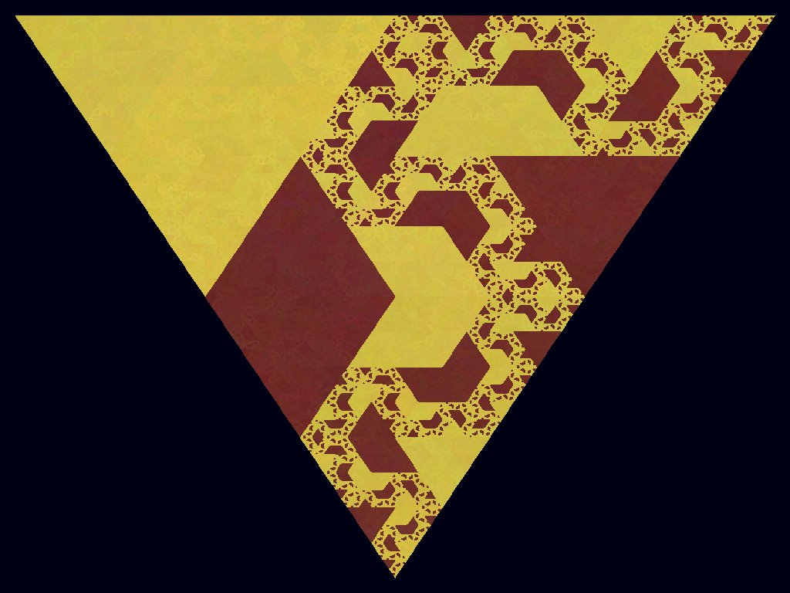
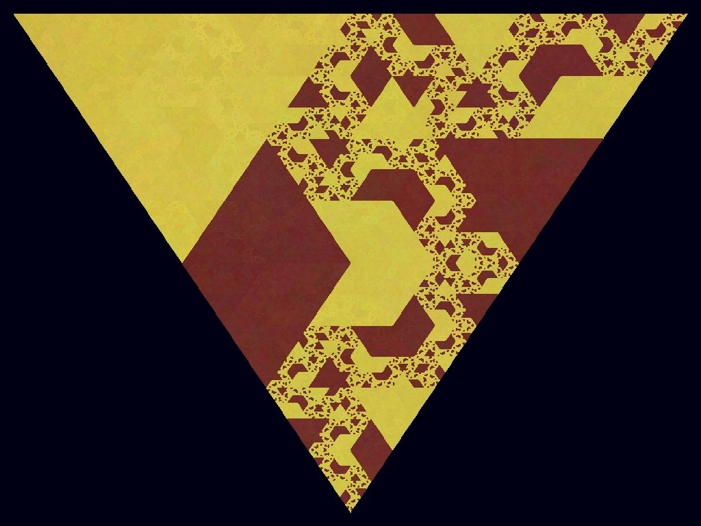
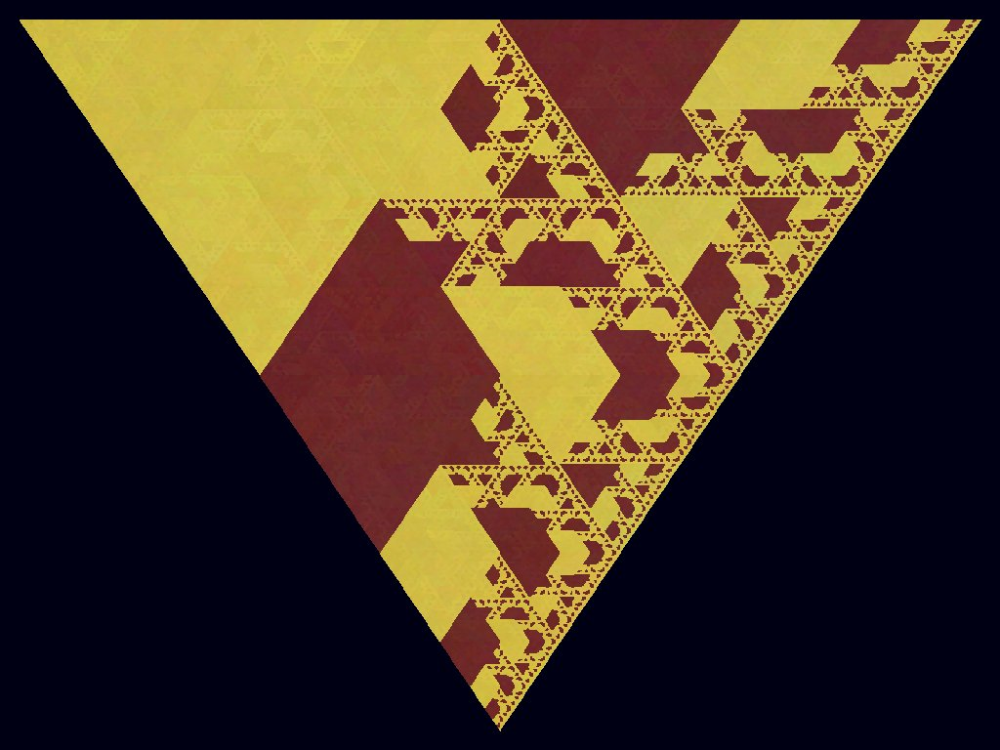
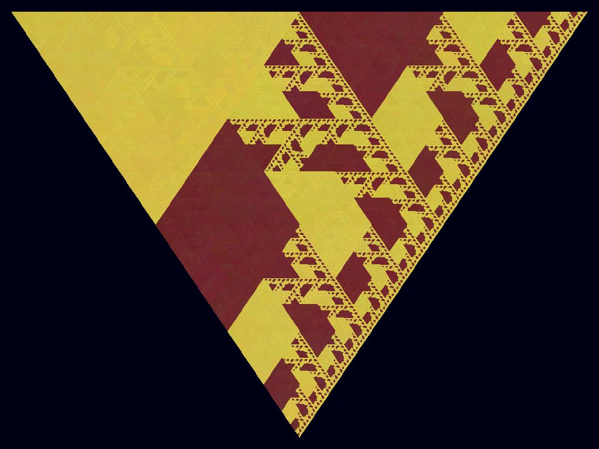
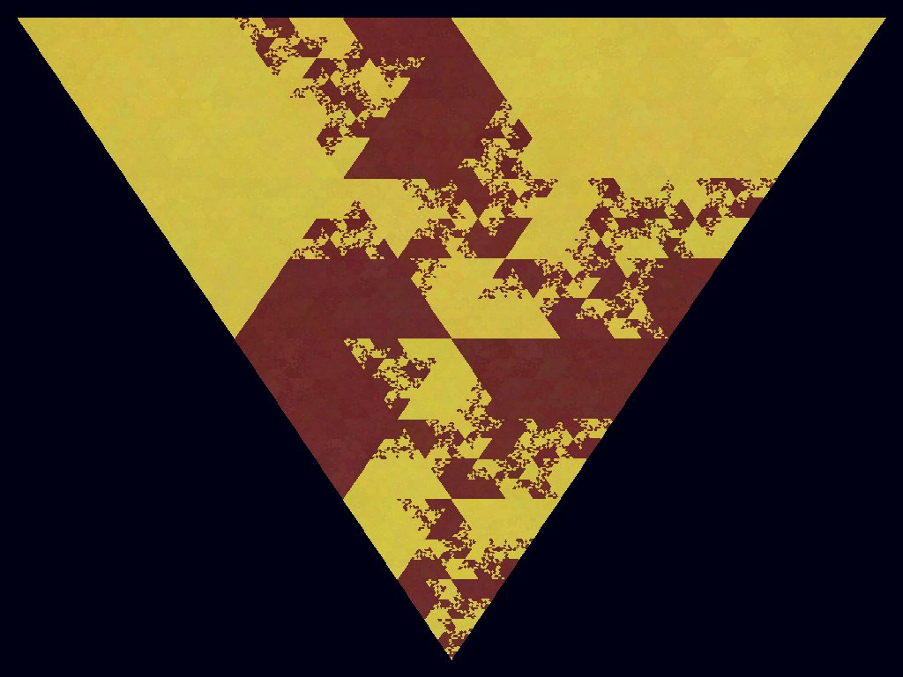
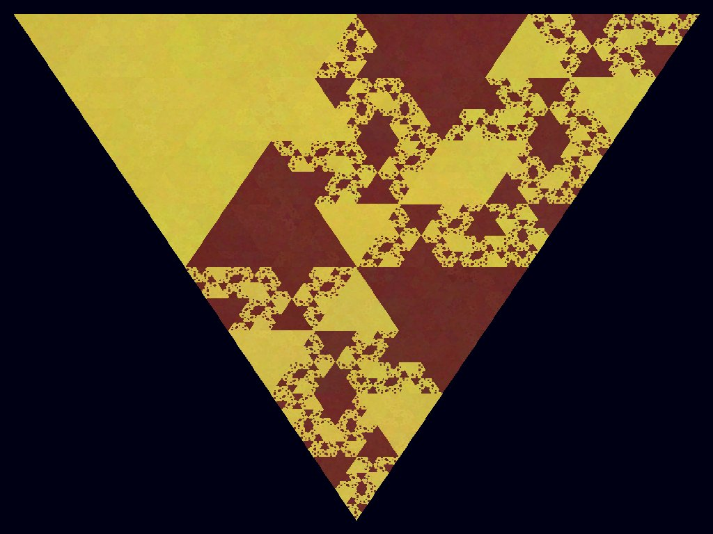

# Sierpinski Triangle Generator

This project generates a Sierpinski Triangle using Python and Pygame. It also saves the generated images and creates a video from them.

## Getting Started
```bash
git clone git@github.com:HN026/Sierpinski-Triangle.git
cd Sierpinski-Triangle
pip install -r requirements.txt
python sierpinskicolored.py
python sierpinskigeneral.py
```

## Output

### Output of SierpinskiGeneral
You can watch the video [here](./output.avi).

### Output of SierpinskiColored

Here are some sample outputs:

<table>
  <tr>
    <td></td>
    <td></td>
    <td></td>
  </tr>
  <tr>
    <td></td>
    <td></td>
    <td></td>
  </tr>
</table>

## Resources
[Wikipedia](https://en.wikipedia.org/wiki/Sierpi%C5%84ski_triangle)